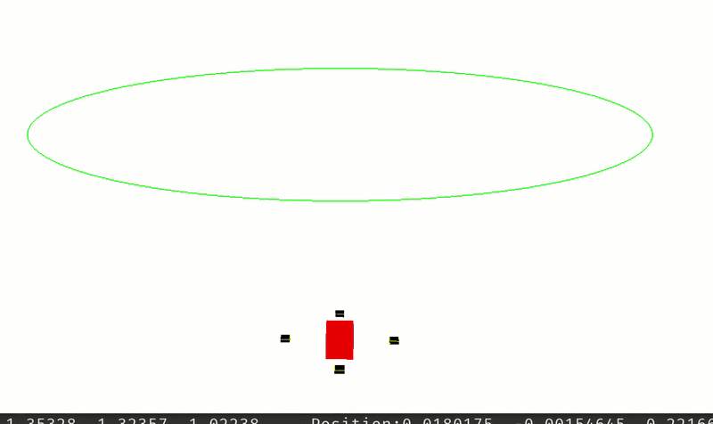

Read the pdf called ReadMeAlso.pdf for the explanation.


---



---


To run the code you build from the build folder

from the repository root, run:
```
cd build
```
```
cmake -DCMAKE_BUILD_TYPE=Release .. && make
```
```
./Simulation
```

use the plot.py file to plot the response after exiting the simulation.